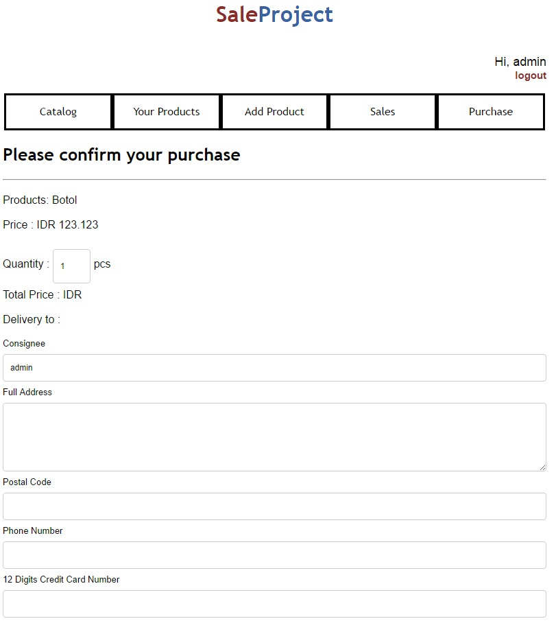

# Tugas 1 IF3110 Pengembangan Aplikasi Berbasis Web

Membuat Website Marketplace sederhana.

## Deskripsi Singkat

Pada tugas besar ini, kami diminta untuk membuat aplikasi *marketplace* **berbasis web** yang memungkinkan seorang pengguna membeli dan menjual barang. Untuk menggunakan aplikasi ini, pengguna harus login terlebih dahulu. Pengguna tersebut dapat membeli dan menjual barang dengan akun yang sama.

Kami diminta untuk membuat tampilan sedemikian hingga mirip dengan tampilan pada contoh. Website yang diminta tidak harus responsive. Desain tampilan tidak perlu dibuat indah. Icon dan jenis font tidak harus sama dengan contoh. Warna font, garis pemisah, dan perbedaan ukuran font harus terlihat sesuai contoh. Format harga dan waktu harus terlihat sesuai contoh. Perhatikan juga **tata letak** elemen-elemen.

## Anggota Tim Anti-Bootstrap

Anggota tim pada pengerjaan tugas ini adalah :
Ari Pratama Zhorifiandi - 13514039
Ramos Janoah Hasudungan - 13514089
Jovian Christianto - 13514101

## Tools

1. Backend menggunakan **PHP**.
2. Basisdata menggunakan **MySQL**.
3. Frontend menggunakan Javascript, HTML dan CSS.

## Spesifikasi

### Login

Pengguna dapat melakukan login sebagai user. Login hanya membandingkan username dan password saja, dan tidak perlu proteksi apapun. Halaman ini merupakan halaman pertama yang dibuka oleh pengguna ketika menjalankan aplikasi. Tidak ada proses otentikasi apakah pengguna sudah login atau belum dalam page lainnya. Identitas pengguna yang sedang login diberikan melalui HTTP GET pada URL (sebagai contoh: /catalog.php?user=admin menandakan bahwa pengguna yang sedang login memiliki username = admin).

### Register

Pengguna dapat mendaftarkan diri sebagai user agar dapat menggunakan aplikasi ini. Hanya terdapat **satu** jenis user, yaitu user yang dapat membeli sekaligus menjual barang. Anda harus melakukan validasi bahwa email dan username yang sama tidak boleh digunakan untuk dua kali mendaftar. Setelah selesai register, otomatis masuk ke halaman Catalog dengan keadaan sudah login.

### Catalog

Catalog merupakan halaman utama yang ditampilkan ketika user telah login. Catalog menampilkan list barang yang dijual oleh seluruh pengguna. Barang-barang tersebut ditampilkan terurut dimulai dari barang yang baru ditambahkan.

Perlu diperhatikan, tulisan di atas tombol logout memiliki format "Hi, <<username>>!". Selanjutnya, terdapat menu bar yang menampilkan 5 menu utama seperti pada gambar. Menu yang sedang dibuka diberikan warna background yang berbeda sebagai penanda halaman apa yang sedang dibuka pengguna.

Lalu, terdapat search bar. Pengguna dapat mencari barang dengan melakukan search ke `username (store)` atau `nama barang (product)` sesuai dengan pilihan pada radio button di bawah search bar.

Pada list barang, pengguna dapat membeli (buy) dan menyukai (like) barang. Terdapat juga informasi jumlah like dan jumlah barang tersebut yang sudah laku (purchased). 

Ketika pengguna menekan tombol like, halaman tidak boleh refresh dan jumlah like akan berubah dan tersimpan ke basis data. **Fungsionalitas Like diimplementasi dengan menggunakan AJAX**. Selain itu, tulisan like akan berubah menjadi **Liked** dan **berubah warna menjadi merah**. Jumlah like akan berubah sesuai dengan banyaknya like pada basis data (jadi tidak asal nambah satu saja). Hal tersebut juga berlaku sebaliknya (unlike). Unlike dapat dilakukan dengan menekan tombol Liked.

Ketika pengguna menekan tombol buy, pengguna akan menuju halaman confirmation purchase.

### Confirmation Purchase

Pada halaman ini, pengguna harus mengisi identitas terkait pengiriman barang. Pada field selain credit card number, sudah terisi sesuai dengan data pengguna namun tetap dapat diubah. Untuk field quantity memiliki nilai default 1. Total harga otomatis dihitung dengan menggunakan javascript. Lakukan konfirmasi pembelian terlebih dahulu dengan javascript, seperti “Apakah data yang anda masukan benar?”. Setelah mengkonfirmasi, pengguna akan diarakahkan ke halaman *Purchases*.

### Your Products

Halaman ini berisikan list barang yang dijual oleh pengguna. Pada menu ini, pengguna dapat melakukan edit dan delete pada barang. Untuk delete, lakukan konfirmasi penghapusan terlebih dahulu dengan javascript.

### Add Product

Pengguna dapat menambahkan barang yang ingin dijual. Fungsionalitas ini menggunakan HTTP POST.  *Redirect* ke halaman *Your Products* setelah selesai menambahkan.

### Edit Product

Pengguna dapat mengubah info barang yang sudah dibuat. Form yang digunakan memiliki tampilan yang sama dengan form untuk add product, namun field-field yang ada sudah terisi. Gunakan HTTP POST.

### Sales

Halaman ini berisi histori penjualan barang yang dijual oleh pengguna. Apabila data barang tersebut diubah/dihapus, tidak mempengaruhi histori (tetap seperti pada data ketika dilakukan pembelian).

### Purchases

Halaman ini berisi histori pembelian barang oleh pengguna. Apabila data barang tersebut diubah/dihapus, tidak mempengaruhi histori (tetap seperti pada data ketika dilakukan pembelian).

### Validasi

Validasi yang sudah dilakukan pada tugas kali ini:
- Setiap field pada form tidak boleh kosong. Termasuk juga gambar barang ketika add product.
- Email harus sesuai format email.
- Harga harus integer.
- Khusus deskripsi pada add dan edit product, pastikan terdiri dari maksimal 200 karakter.
- Nilai dari Card Verification Value harus terdiri dari 3 digit.
- Nilai dari Credit Card harus terdiri dari 12 digit.

### Pembagian Tugas

**Tampilan**
1. Login : 13513039, 13514089, 13514101
2. Register : 13513039, 13514089, 13514101
3. Catalog : 13513039, 13514089, 13514101
4. Confirmation Purchase : 13513039, 13514089, 13514101
5. Your Products : 13513039, 13514089, 13514101
6. Add Product : 13513039, 13514089, 13514101
7. Edit Product : 13513039, 13514089, 13514101
8. Sales : 13513039, 13514089, 13514101
9. Purchases : 13513039, 13514089, 13514101

**Fungsionalitas**
1. Login : 13513039, 13514089, 13514101
2. Register : 13513039, 13514089, 13514101
3. Catalog : 13513039, 13514089, 13514101
4. Confirmation Purchase : 13513039, 13514089, 13514101
5. Your Products : 13513039, 13514089, 13514101
6. Add Product : 13513039, 13514089, 13514101
7. Edit Product : 13513039, 13514089, 13514101
8. Sales : 13513039, 13514089, 13514101
9. Purchases : 13513039, 13514089, 13514101

## About

Tugas ini dikerjakan oleh : 
Jovian Christianto
Ramos Janoah
Ari Pratama Zhorifiandi